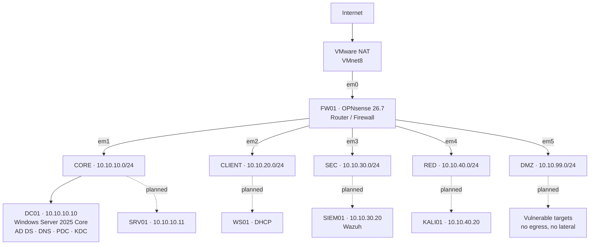

# VAULTLAB

A segmented enterprise virtualization lab built on a single laptop, from bare host
to domain services, network segmentation, SIEM, compliance scanning, and adversary
simulation. Everything free, everything documented, everything rebuildable.

**Objective:** infrastructure operator with security fluency and compliance evidence.
The lab exists to produce artifacts, not just working machines.

---

## Topology

## Host platform

| | |
|---|---|
| Machine | Gigabyte G5 KF |
| CPU | Intel i5-12500H — 4P + 8E, 16 threads |
| RAM | 24 GB DDR4-3200 (16 + 8) |
| Storage | ~537 GB free NVMe |
| Host OS | Windows 11 |
| Hypervisor | VMware Workstation Pro 26H1 |

Usable VM budget after host overhead: **~16 GB**. See [`docs/resource-budget.md`](docs/resource-budget.md).

## Current state

| Component | Status | Notes |
|---|---|---|
| Host preparation | Complete | Hyper-V and VBS disabled and verified |
| Virtual network fabric | Complete | VMnet2–VMnet6, DHCP disabled, host adapter on CORE only |
| FW01 — OPNsense | Complete | 6 interfaces, routing, NAT, DNS, DHCP, DMZ isolation |
| DC01 — base OS | Complete | Server Core, activated, networked, renamed |
| DC01 — AD DS promotion | Complete | Forest `corp.vaultlab.net`, functional level Windows2025 |
| DC01 — DNS and time | Complete | Self-reference, forwarder, reverse zone, NTP from FW01 |
| DC01 — OU structure | Complete | VAULTLAB OU tree, split admin accounts |
| WS01 — Windows 11 client | Not started | **Next** |
| SIEM01 — Wazuh | Not started | |
| Segmentation hardening | Not started | Temporary allow-all rules in place |

## Repository map

| Path | Contents |
|---|---|
| `adr/` | Architecture Decision Records — what was chosen and why |
| `docs/` | Reference: addressing, interfaces, firewall policy, budget, troubleshooting |
| `runbooks/` | Reproducible build procedures |
| `ansible/` | Automation (Phase 2 onward) |
| `evidence/` | Compliance scan output, before/after remediation |
| `diagrams/` | Mermaid sources and exports |
| `scripts/` | PowerShell and shell helpers |

## Roadmap

- **Phase 1** — Foundation. Firewall, domain controller, domain-joined client. *In progress.*
- **Phase 2** — Automation. Ansible rebuild of the forest. DHCP relay to Windows.
- **Phase 3** — Networking depth. Containerlab, OSPF, BGP. Retire ADR-007.
- **Phase 4** — Detection and compliance. Wazuh agents, OpenSCAP against CIS/STIG, remediate, rescan.
- **Phase 5** — Adversary simulation. GOAD-Light, Kali, PCAP capture, Security Onion Import node.

## Safety note

This lab has no internet-facing exposure. All addressing is RFC1918 on host-only
virtual switches. Deliberately vulnerable systems live on the DMZ segment, which is
denied both internet egress and lateral movement at the firewall.
