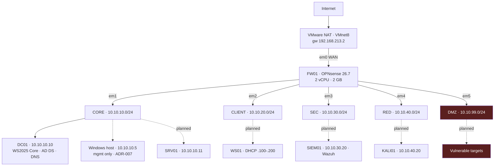

# Topology

## Logical

## The model

A physical firewall appliance is a box with several ethernet ports: one to the
ISP, the others to switches serving different parts of an office. Traffic between
those areas must pass through the firewall because no other wire connects them.

This is the same design in software:

- **A VMware "Network Adapter" = one physical port on the appliance.**
- **A VMnet = one physical switch.**

VMnet2 through VMnet6 are five switches with no wire between them. The only
device touching all of them is FW01. Every packet crossing from CLIENT to CORE
must traverse the firewall, where it can be inspected, permitted, or dropped.

Give two VMs the same VMnet and they talk directly — the firewall becomes
decorative. This is why each VM gets exactly one adapter on exactly one segment.

## Trust ordering

| Segment | Trust | Reasoning |
|---|---|---|
| CORE | Highest | Directory services. Compromise here is total. |
| SEC | High | Holds logs and evidence. Must not be reachable from what it monitors. |
| CLIENT | Medium | User workstations. Assumed to be the initial foothold. |
| RED | Low | Attack tooling. Deliberately hostile. |
| DMZ | None | Deliberately vulnerable. No egress, no lateral movement. |
